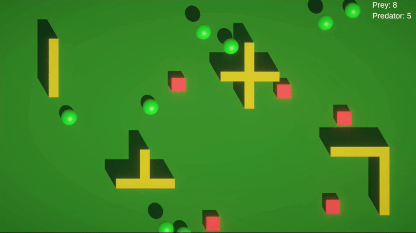

# Zoo World

> **Language:** **English** | [Русский](docs/README-ru.md)

A small top-down 3D life-simulation built as a test task, with a strong focus on **animal architecture**: adding a new animal should cost a new ScriptableObject asset and — at most — a few tiny new classes, never a change to existing code.

**Unity 2022.3.44f1** · URP · Zenject/Extenject · UniRx · UniTask · DoTween · TextMeshPro · uGUI + MVVM · `UnityEngine.Pool`

---

## Gameplay



Every 1–2 seconds an animal spawns and wanders the platform driven by physics. Animals bounce off obstacles, turn back when they reach the edge of the camera, and interact through a food chain:

- **Prey × Prey** — scatter apart (physics impulse).
- **Predator × Prey** — the prey is eaten and returns to the pool; a **"Tasty!"** label pops above the predator.
- **Predator × Predator** — one of them dies.

A reactive death counter (dead prey / dead predators) sits in the top-right corner. Two species ship by default: **Frog** (prey, jumps) and **Snake** (predator, moves linearly).

---

## Tech stack

| Concern | Choice |
|---|---|
| DI | Zenject/Extenject — installers, factories, no singletons |
| Reactive | UniRx — `ReactiveProperty`, `Observable.EveryFixedUpdate`, `CompositeDisposable` |
| Async | UniTask — spawn loop and label lifecycle (with `CancellationToken`) |
| Animation | DoTween — spawn/death scale, "Tasty!" float-and-fade |
| Data | ScriptableObject — animal & movement configs |
| UI | uGUI + MVVM + reactive counters |
| Pooling | `UnityEngine.Pool.ObjectPool<T>` — no runtime `Instantiate`/`Destroy` |

---

## Architecture at a glance

- **Logic is POCO, views are thin MonoBehaviours.** `Animal` is a plain C# orchestrator that owns its collaborators (movement, health, FSM); `AnimalView` only holds the `Rigidbody`/`Collider` and forwards collisions.
- **One update for the whole game.** `UpdateHandler` subscribes to `Observable.EveryFixedUpdate` and ticks every registered `IFixedTickTarget`. No per-animal `Update()`.
- **Composition over inheritance.** No `Animal → Prey → Frog` tree. A species is data + a movement strategy + a role.
- **Single composition root.** One Zenject `SceneContext`, five focused installers, linear UniTask bootstrap. No global game FSM (FSM is used only for *animal* states: `Moving`, `ReturningToScreen`, `Dead`).
- **Assemblies form a one-way dependency graph** (`Common → Data → Gameplay / UI → Infrastructure`). Gameplay and UI never reference each other — they talk through contracts in `Common` (`IDeathReporter`, `ITastyLabelSpawner`, `IFixedTickRegistry`).

```
Assets/_Project/Scripts/
├── Common/          # enums, contracts, ScreenBounds, RandomDirection
├── Data/            # ScriptableObjects: AnimalDefinition, MovementConfig, GameSettings
├── Gameplay/
│   ├── Animals/     # Base (Animal, AnimalView, Health), States (FSM), Factory
│   ├── Movement/    # Strategies, Builders, MovementStrategyFactory
│   ├── FoodChain/   # AnimalFoodChainService + Rules
│   ├── Spawn/       # AnimalSpawner (UniTask), interval & weighted selection
│   └── Pool/        # AnimalPoolService, AnimalPoolLifecycleCoordinator
├── UI/              # Model / ViewModel / View (MVVM), TastyLabel
└── Infrastructure/  # GameBootstrap, UpdateHandler, Installers
```

---

## Design patterns

| Pattern | Where it lives |
|---|---|
| **Dependency Injection** | Zenject `SceneContext` + five installers; constructor injection everywhere, `IEnumerable<>` injection for rules/builders |
| **Composition over inheritance** | `Animal` orchestrates collaborators (movement, health, FSM, view) instead of a class hierarchy |
| **Strategy** | `IMovementStrategy` → `LinearMovementStrategy` / `JumpMovementStrategy` |
| **Builder** | `IMovementStrategyBuilder` builds a strategy from its own `MovementConfig`, registered in the installer |
| **Factory** | `MovementStrategyFactory` (dictionary dispatch, no `switch`) and `AnimalFactory` |
| **State (FSM)** | `IAnimalState` + `AnimalStateMachine` (`Moving` / `ReturningToScreen` / `Dead`) — per-animal only |
| **Rule set / Chain of Responsibility** | `AnimalFoodChainService` applies the first matching `ICollisionRule` |
| **Object Pool** | `AnimalPoolService` and `TastyLabelPool` over `UnityEngine.Pool.ObjectPool<T>` |
| **MVVM** | `AnimalStatisticsService` (Model) → `DeathCounterViewModel` → `DeathCounterView` |
| **Observer / Reactive** | UniRx `ReactiveProperty`, `Observable.EveryFixedUpdate`, and `event`-based collision/death signals |
| **Template Method** | shared bases `DirectedMovementStrategyBase` and `PredatorFeedingRule` (code reuse, not species polymorphism) |
| **Registry** | `AnimalCollisionRegistry` resolves an `Animal` from a colliding `Rigidbody` |
| **Mediator / Coordinator** | `AnimalPoolLifecycleCoordinator` ties together pool, tick registry, food chain and death |
| **Update manager** | `UpdateHandler` drives every `IFixedTickTarget` from one `EveryFixedUpdate` |
| **Dependency Inversion** | cross-assembly contracts in `Common` (`IDeathReporter`, `ITastyLabelSpawner`, `IFixedTickRegistry`) |
| **Data-driven configuration** | ScriptableObjects (`AnimalDefinition`, `MovementConfig`, `GameSettings`, `AnimalRegistry`) |

---

## Where to start reading

1. **[`GameBootstrap`](Assets/_Project/Scripts/Infrastructure/GameBootstrap.cs)** — entry point (`IInitializable`): warms the pools, starts the spawn loop.
2. **[Installers](Assets/_Project/Scripts/Infrastructure/Installers)** — how everything is wired (`GameSettings → Gameplay → Animal → Spawn → UI`).
3. **[`AnimalFactory`](Assets/_Project/Scripts/Gameplay/Animals/Factory/AnimalFactory.cs)** — assembles a live `Animal` from an `AnimalDefinition`.
4. **[`IMovementStrategy`](Assets/_Project/Scripts/Gameplay/Movement/Strategies/IMovementStrategy.cs)** + **[`MovementStrategyFactory`](Assets/_Project/Scripts/Gameplay/Movement/MovementStrategyFactory.cs)** — Strategy + Builder, dispatched without a `switch`.
5. **[`AnimalFoodChainService`](Assets/_Project/Scripts/Gameplay/FoodChain/AnimalFoodChainService.cs)** + **[`ICollisionRule`](Assets/_Project/Scripts/Gameplay/FoodChain/Rules/ICollisionRule.cs)** — collision resolution as a set of data-driven rules keyed by `AnimalRole`.
6. **[`AnimalStatisticsService`](Assets/_Project/Scripts/UI/Model/AnimalStatisticsService.cs)** — reactive dictionary behind the MVVM counter.

---

## How to add a new animal

The whole design answers one question: *how trivial is it to add a new animal without touching existing code?*

**Case 1 — new species, existing behaviour** (e.g. another prey that jumps):
1. Create a new `AnimalDefinition` asset (role, HP, color, prefab, spawn weight) and point it at an existing `MovementConfig`.
2. Add it to the `AnimalRegistry`.
→ **Zero code changes.**

**Case 2 — new movement** (e.g. a bird that flies):
1. Add a value to the `MovementType` enum and a matching `MovementConfig` (its own fields only).
2. Add an `IMovementStrategy` + an `IMovementStrategyBuilder`.
3. Register the builder with one line in `AnimalInstaller`.
→ Existing strategies and the factory are untouched (the factory resolves builders from the container).

**Case 3 — new interaction** (e.g. a scavenger that ignores predators):
1. Add a new `ICollisionRule` and bind it in `AnimalInstaller`.
→ Existing rules stay as they are; `AnimalFoodChainService` applies the first matching rule.

---

## Highlights

- **DI without singletons** — no `static` state, no service locator; the container owns lifecycles via `IInitializable`/`IDisposable`.
- **Open-Closed everywhere** — new movement/interaction = new small class + registration; nothing existing is modified.
- **No type checks by species** — branching is only on `AnimalRole`; there is not a single `is Frog` / `switch`-by-type.
- **Object pooling** for animals and labels — no GC spikes on spawn.
- **Physics-driven** movement and collisions (Rigidbody); DoTween is used only for visual polish, never for animal movement.

---

## Requirements & running

- **Unity 2022.3.44f1** (URP).
- UniTask and UniRx are pulled via git URLs in `Packages/manifest.json` and resolve automatically on first open (internet required).
- Open the project, load `Assets/_Project/Scenes/Game.unity`, and press **Play**.
- If DoTween prompts for setup, run `Tools → Demigiant → DOTween Utility Panel → Setup DOTween…`.
